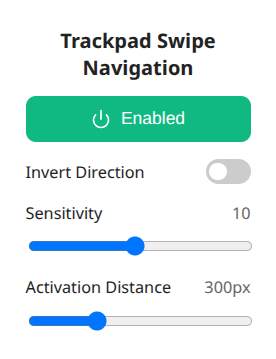

# **Trackpad Swipe Navigation – Chrome/Chromium Extension**

A minimal and lightweight extension that enables **Back** and **Forward** navigation using **two-finger horizontal swipe gestures**, especially useful on systems where native browser swipe does not work, such as **Linux running X11**.

This brings a Safari/macOS–like gesture experience to Chrome, Brave, and other Chromium-based browsers.


## Why?

Many Linux setups (particularly **X11**) do **not support native two-finger swipe navigation** in Chrome/Chromium.
Wayland supports it better, but not all distros or drivers are ready.

This extension solves that by detecting horizontal scroll gestures (`wheel` events) and triggering browser navigation.

Perfect if:

* You use **Chrome/Chromium/Brave on X11**
* Your trackpad scroll events register correctly but **native gesture navigation is missing**
* You prefer gestures over keyboard shortcuts or toolbar buttons
* You want a simple, dependency-free solution


## Features

* Swipe left => **Back**
* Swipe right => **Forward**
* Optional **Invert Direction**
* **Enable/Disable** anytime from the popup
* Lightweight (no frameworks, no libraries)
* 100% local, *no tracking, no external requests*

## Preview




## Installation (Developer Mode)

1. Clone the repo:

   ```bash
   git clone https://github.com/adlifarizi/trackpad-swipe-navigation.git
   ```
2. Open Chrome/Brave:

   ```
   chrome://extensions/
   ```
3. Enable **Developer Mode**
4. Click **Load unpacked**
5. Select the project folder


## Browser Support

| Browser             | Status           | Notes                                     |
| ------------------- | ---------------  | ----------------------------------------- |
| **Chrome**          | ✅ Working       | Recommended                               |
| **Brave**           | ✅ Working       | Personally used & tested                  |
| **Chromium**        | ✅ Working       | Should behave identically                 |
| **Edge (Chromium)** | ⚪ Not tested    | Should work                               |
| **Firefox**         | ❌ Not supported | Firefox uses a different extension API    |
| **Safari**          | ❌ Not supported | Requires WebExtension → Safari conversion |

If someone wants to help port this to Firefox or Safari, PRs are welcome!

---

## How It Works (Short Version)

* `content.js`
  Detects swipe gestures using accumulated horizontal scroll input.

* `background.js`
  Handles navigation via:

  * `chrome.tabs.goBack()` / `goForward()`
  * Fallback to `history.back()` / `history.forward()` if needed

* `popup.html / popup.js`
  UI to toggle the extension & invert direction.
  Settings stored via `chrome.storage.sync`.

---

## Issues & Contributions

If something doesn’t work on your device (different touchpad driver, DE, browser, etc.), feel free to:

- **Open an Issue**
- **Submit a Pull Request**
- **Fork and extend** (Firefox/Safari port welcome!)

Everything here is intentionally simple for others to modify easily.

---

## Icon & SVG Attribution

Gesture arrow icons used inside the script originate from:

**Font Awesome Free v7.1.0**
<br>License: [https://fontawesome.com/license/free](https://fontawesome.com/license/free)
<br>Copyright 2025 Fonticons, Inc.

SVG paths were embedded directly into the script (`LEFT_SVG_PATH` and `RIGHT_SVG_PATH`).


## Privacy

This extension **does NOT**:

* collect analytics
* store browsing data
* read page content
* send anything to a server

Everything stays on your device.


## License

MIT License

Copyright (c) 2025 Adli Farizi (Kayoi)

Permission is hereby granted, free of charge, to any person obtaining a copy
of this software and associated documentation files (the "Software"), to deal
in the Software without restriction, including without limitation the rights
to use, copy, modify, merge, publish, distribute, sublicense, and/or sell
copies of the Software, and to permit persons to whom the Software is
furnished to do so, subject to the following conditions:

The above copyright notice and this permission notice shall be included in all
copies or substantial portions of the Software.

THE SOFTWARE IS PROVIDED "AS IS", WITHOUT WARRANTY OF ANY KIND, EXPRESS OR
IMPLIED, INCLUDING BUT NOT LIMITED TO THE WARRANTIES OF MERCHANTABILITY,
FITNESS FOR A PARTICULAR PURPOSE AND NONINFRINGEMENT. IN NO EVENT SHALL THE
AUTHORS OR COPYRIGHT HOLDERS BE LIABLE FOR ANY CLAIM, DAMAGES OR OTHER
LIABILITY, WHETHER IN AN ACTION OF CONTRACT, TORT OR OTHERWISE, ARISING FROM,
OUT OF OR IN CONNECTION WITH THE SOFTWARE OR THE USE OR OTHER DEALINGS IN THE
SOFTWARE.